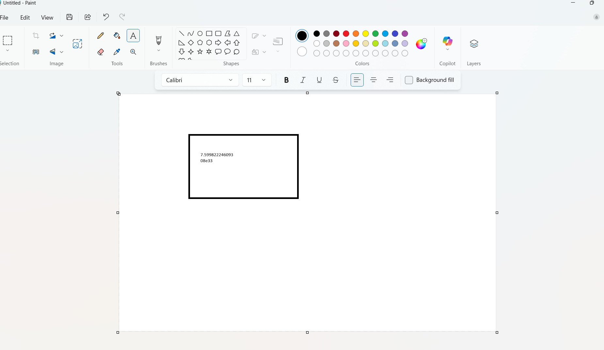

### EAG-Session-04 Assignment 

### Contents

- [Requirements](#requirements)
- [Development Method](#development-method)
    - [Overview](#Overview)
    - [Usage](#usage)
- [Learnings](#learnings)
- [Results Screenshots](#results)

### Requirements

In short write a mcp server that can 

1. convert word India to ascii characters

2. calculate a exponential value

3. open paint, create a rectange 

4. Add the answer inside the rectangle

5. Send the answer as email

From EAG course
- Paint App doesn't have an MCP server so that is what we'll need to do. I called 3 commands, open_paint, draw_rectangle, and then add_text_in_paint. Your assignment is to call it using Agent. 
- YouTube video clearly showing the paint (or another app) with added text, and then scrolling through the LLM logs, where I can see that you indeed made LLM do it
- Link to your talk2mcp.py file on GitHub where I can see how you did it
- [BONUS OPTIONAL 2000 Points]: Another video, where instead of drawing you receive an email (gmail) from this LLM using Gmail MCP. Show LLM logs as well.

### Development Method

### Overview

Write a mcp server that can 
1. convert word India to ascii characters
2. calculate a exponential value
3. open paint, create a rectange 
4. Add the answer inside the rectangle
5. Send the answer as email

Method

- Write MCP server functionalities in `paint_mcp_server.py` to draw rectangle, write text. Make sure you adjust the coordinates in accordance with your system. As they are hardcoded.
- Write logging functionality instead of print
- Test it with `mcp dev paint_mcp_server.py`
- Now go to `talk2mcp.py` and adjust the prompts and other functionalites to satisfy the requirement

#### Usage

**Installations**

- `pip install -r requirements.txt`

**Execution**

- `python talk2mcp.py`

**Testing**

- `mcp dev paint_mcp_server.py`

### Learnings

- Learnt how to create mcp server functions
- Learnt how to prompt

### Results

- [Youtube Video Link](https://youtu.be/G8jJP5K6sik)

**Paint App**

**Email functionality**

**Logs**

